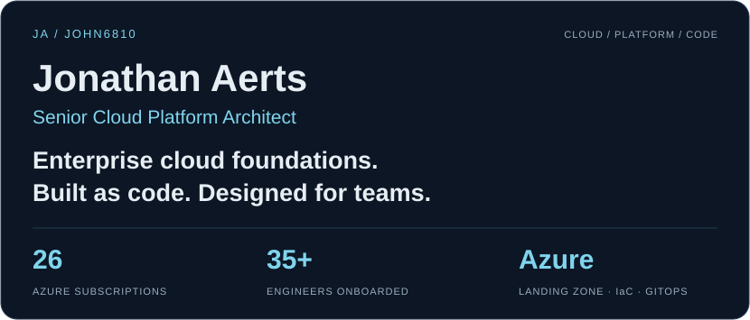
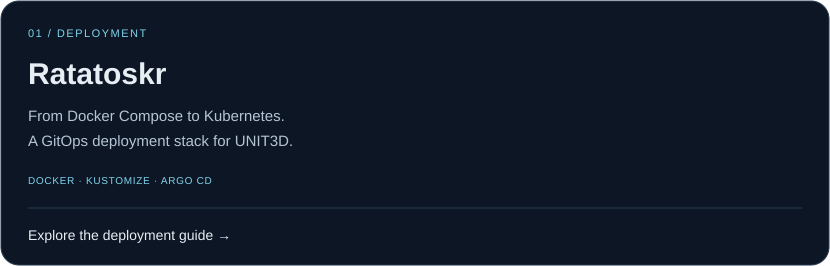
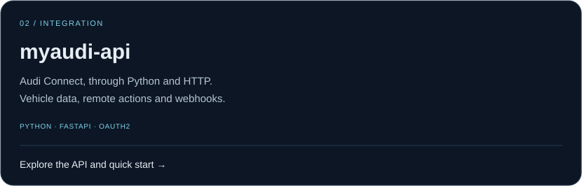
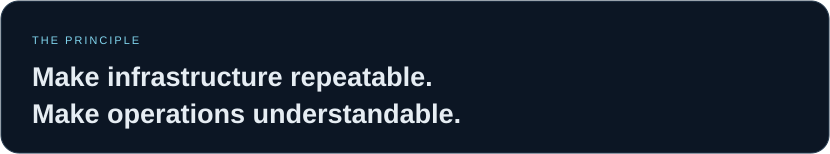

  

  <a href="https://jonathan-aerts.dev"><strong>Visit my portfolio ↗</strong></a> &nbsp; · &nbsp;
  <a href="https://www.linkedin.com/in/jaerts085"><strong>Connect on LinkedIn ↗</strong></a> &nbsp; · &nbsp;
  <a href="#projects"><strong>Explore my projects ↓</strong></a>

I design and govern enterprise-scale **Azure foundations**: landing zones, hub-and-spoke networking, policy-as-code and GitOps-driven infrastructure. I built an Azure landing zone from scratch for a regulated financial workload, spanning **26 subscriptions** and onboarding **35+ engineers**.

Belgium-based · Open to senior individual contributor roles across EMEA.

### `~/projects`

**[Deploy with Docker Compose →](https://github.com/John6810/Ratatoskr#-quick-start)** · [Architecture](https://github.com/John6810/Ratatoskr/blob/main/docs/architecture.md) · [Source](https://github.com/John6810/Ratatoskr)

Deployment templates with Kubernetes production overlays, NetworkPolicies, autoscaling, backup and restore documentation. Helm and Terraform are on the roadmap.

**[Try the Python client →](https://github.com/John6810/myaudi-api#quick-start)** · [API reference](https://github.com/John6810/myaudi-api/blob/main/docs/api-reference.md) · [Source](https://github.com/John6810/myaudi-api)

CLI and HTTP access to vehicle status and remote actions, with OAuth token management, webhook notifications and Prometheus metrics. Independent project, based on [audi_connect_ha](https://github.com/audiconnect/audi_connect_ha/); not affiliated with Audi.

### `~/approach`

- **Govern the foundation** — CAF-aligned landing zones, management groups and policy-as-code.
- **Automate the path** — Terraform, Terragrunt, Azure Verified Modules and GitOps workflows.
- **Design for operation** — secure connectivity, private endpoints and AMBA-based monitoring.
- **Enable the team** — self-service infrastructure, golden paths and developer enablement.

### `~/stack`

**Cloud** &nbsp; Azure · Landing Zones · Governance 
**Infrastructure** &nbsp; Terraform · Terragrunt · Azure Verified Modules 
**Delivery** &nbsp; Kubernetes · Argo CD · GitHub Actions 
**Integration** &nbsp; Python · FastAPI · Docker

### `~/now`

Exploring AWS landing zone patterns with Control Tower and SCPs, and writing up practical lessons on [my blog](https://jonathan-aerts.dev/blog).

---

**Building a cloud platform or growing a platform team?** [Let's connect →](https://www.linkedin.com/in/jaerts085)
